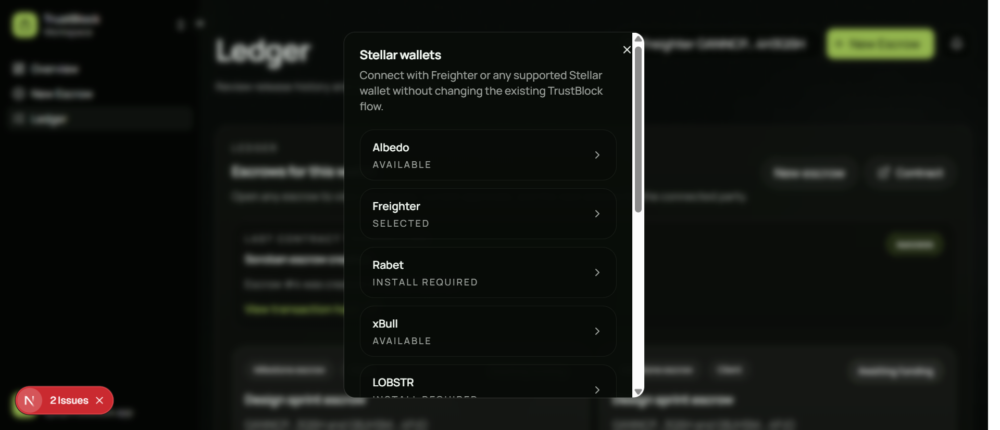
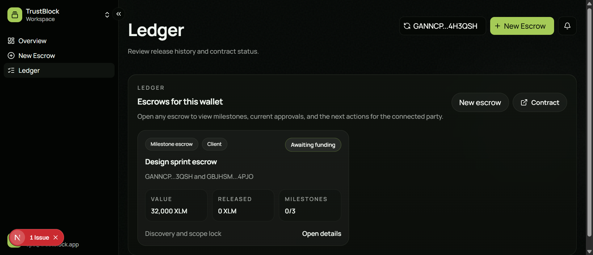

# TrustBlock on Stellar

TrustBlock is a Stellar-native milestone escrow app for service payments. This hackathon workspace is the Stellar Journey to Mastery version of the product, adapted to Soroban with multi-wallet Stellar support and live contract activity surfaced in the frontend.

## Current Scope

- Multi-wallet Stellar connection through `StellarWalletsKit`
- Stellar testnet detection in the frontend
- Live Soroban escrow contract deployed on Stellar testnet
- Real `create_escrow` contract invocation from the app
- Visible contract transaction state in the UI
- Ledger sync plus a lightweight live activity feed for onchain changes

## Submission Checklist

This project is prepared for the Level 2 Yellow Belt checklist:

- Public GitHub repository
- README with setup instructions
- Minimum 2+ meaningful commits

Required in this README:

- Live demo link: optional
- Screenshot: wallet options available
- Deployed contract address
- Transaction hash of a contract call that can be verified on Stellar Explorer

## Project Structure

- `frontend/`: TrustBlock frontend adapted for Stellar wallets + Soroban
- `contracts/`: Soroban contract workspace for the Stellar escrow logic

## Deployed Contract

- Network: `Stellar Testnet`
- Contract ID: `CAQGDVXYW6YHIMLXTNCINAPCZXZ37JKLACGEWXQULYJNAGB5JJBHV4NC`
- Contract Explorer: [stellar.expert testnet contract page](https://stellar.expert/explorer/testnet/contract/CAQGDVXYW6YHIMLXTNCINAPCZXZ37JKLACGEWXQULYJNAGB5JJBHV4NC)

## Contract Call Proof

- Latest contract call transaction hash: `0375428654af24921b77d9d97f2087f308190fa6d31447b4e9b471e8d270fb24`
- Explorer link: [stellar.expert verified transaction](https://stellar.expert/explorer/testnet/tx/0375428654af24921b77d9d97f2087f308190fa6d31447b4e9b471e8d270fb24)

## Local Run

From `frontend/`:

```bash
yarn install
yarn dev
```

Then open `http://localhost:3000`.

## Demo Flow

1. Open the app and connect a Stellar wallet from the wallet options modal.
2. Keep the selected wallet on Stellar testnet.
3. Open `New Escrow`.
4. Enter a valid Stellar recipient address.
5. Add milestone amounts in XLM.
6. Click `Create escrow`.
7. Approve the Soroban transaction in the connected wallet.
8. Confirm the transaction status in `Ledger`.
9. Confirm the escrow and activity update in `Overview` and `Ledger`.

## Screenshots

Required screenshots for the submission package:

- Wallet options available
- Wallet connected state
- Successful testnet contract transaction
- Transaction result shown to the user in the app

Current screenshot asset in this repo:

- `frontend/screenshots/wallet-options.png`
- `frontend/screenshots/white-belt-combined-proof.png`

Additional suggested screenshot filename for Yellow Belt:

- `frontend/screenshots/wallet-options.png`

Wallet options screenshot:



Submission proof image:



## Notes

- This repository is a separate Git repository from the original Arbitrum project.
- The frontend UI was intentionally preserved while the wallet and contract layers were migrated to Stellar.
